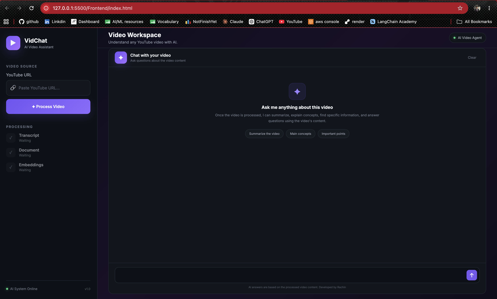
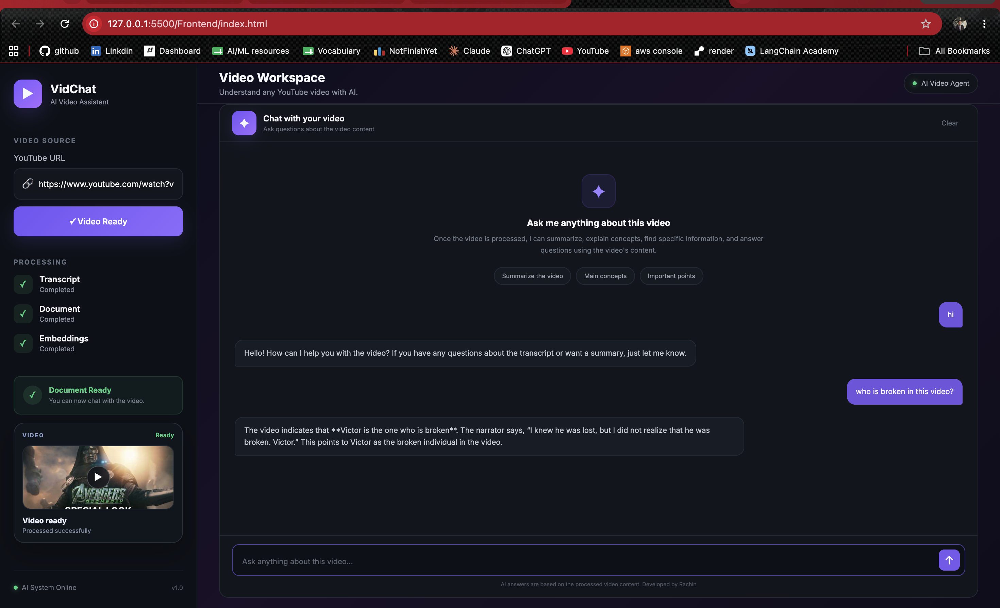
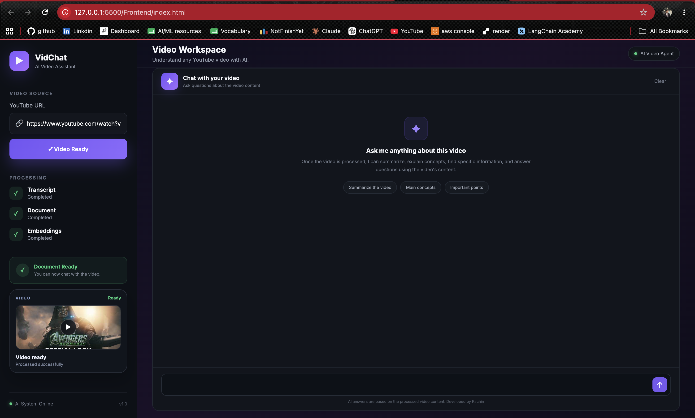

# 🎥 VidChat

**VidChat** is an AI-powered application that allows users to interact with YouTube videos using natural language. Users can provide a YouTube video and ask questions about its content instead of manually watching the entire video.

The project uses **LangChain, FastAPI, vector search, embeddings, and LLMs** to build a Retrieval-Augmented Generation (RAG) pipeline for video question answering.

## ✨ Features

* 🎥 Ask questions about YouTube videos
* 🤖 AI-powered conversational interface
* 🔎 Semantic search over video content
* 🧠 Retrieval-Augmented Generation (RAG)
* 📄 Automatic transcript extraction
* 💬 Chat-style interaction
* ⚡ FastAPI backend
* 🐳 Docker support
* 🔗 LangChain-based AI pipeline

## 🖥️ Screenshots

### Home Page



### Video Analysis



### AI Chat




## 🛠️ Tech Stack

**Frontend**

* HTML
* CSS
* JavaScript

**Backend**

* Python
* FastAPI
* LangChain

**AI / RAG**

* Large Language Models
* Hugging Face Embeddings
* Vector Database
* Semantic Search

**Deployment**

* Docker

## 📂 Project Structure

```text
VidChat/
│
├── Frontend/
│   ├── index.html
│   ├── script.js
│   └── style.css
│
├── backend/
│   ├── main.py
│   ├── extract_video_id.py
│   ├── summarizer.py
│   └── vector_store.py
│
├── Dockerfile
├── requirements.txt
└── README.md
```

## 🚀 Getting Started

### 1. Clone the repository

```bash
git clone https://github.com/Rachin02/VidChat.git
cd VidChat
```

### 2. Install dependencies

```bash
pip install -r requirements.txt
```

### 3. Configure environment variables

Create a `.env` file and add the required API keys.

```env
OPENAI_API_KEY=your_api_key
```

Add any other keys required by your selected LLM or vector database configuration.

### 4. Run the backend

```bash
uvicorn backend.main:app --reload
```

### 5. Open the frontend

Open:

```text
Frontend/index.html
```

in your browser.

## 🔄 How It Works

```text
YouTube Video
      ↓
Transcript Extraction
      ↓
Text Processing
      ↓
Text Chunking
      ↓
Embeddings
      ↓
Vector Store
      ↓
User Question
      ↓
Semantic Search
      ↓
Relevant Context
      ↓
LLM
      ↓
AI Answer
```

## 📌 Future Improvements

* Support multiple videos in one conversation
* Improve duplicate-video detection
* Add user authentication
* Add conversation history
* Improve deployment and scalability
* Add support for more video platforms

## 👨‍💻 Author

**Nure Alam Siddiki Rachin**

GitHub: [Rachin02](https://github.com/Rachin02)

## ⭐ Support

If you find this project useful, consider giving the repository a ⭐ on GitHub.
